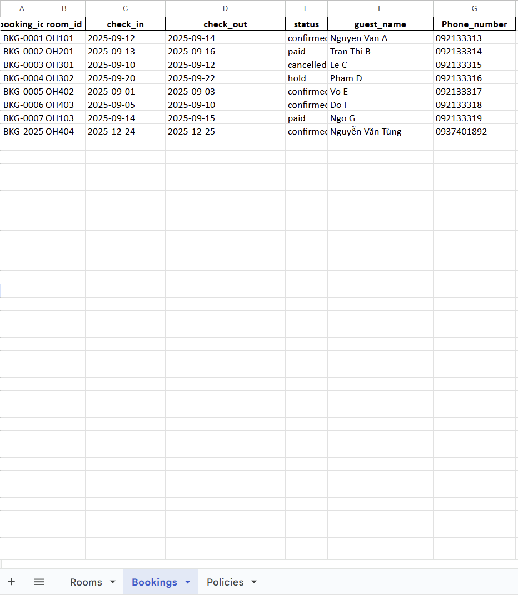

# 🏨 Ohana Hotel Concierge System

An intelligent multi-agent hotel booking and information system built with modern AI technologies, featuring Facebook Messenger integration, RAG-powered document search, and seamless agent-to-agent communication.

## 🌟 Features

### 🤖 Multi-Agent Architecture
- **Host Agent**: Central coordinator powered by Google ADK with shared memory system
- **Booking Agent**: Specialized for room reservations using LangGraph + Gemini
- **GetInfo Agent**: Handles hotel policies and services with RAG (Retrieval-Augmented Generation)

### 💬 Communication Channels
- **Facebook Messenger Bot**: Direct customer interaction with context management
- **A2A Protocol**: Agent-to-Agent communication standard
- **MCP (Model Context Protocol)**: Tool integration and data access

### 🧠 AI Technologies
- **Google Gemini 2.5 Flash**: Primary language model
- **LangGraph**: Workflow orchestration with SQLite checkpointing
- **CrewAI**: Multi-agent coordination
- **RAG System**: Local document search with HuggingFace embeddings

### 📊 Data Integration
- **Google Sheets**: Real-time booking and room management via Booking MCP Server
- **Local Vector DB**: Hotel policy documents via GetInfo MCP Server (FAISS)
- **Session Management**: Per-session isolation with auto-cleanup

## 🏗️ Architecture

```
┌─────────────────┐    ┌──────────────────┐    ┌─────────────────┐
│   Facebook      │────│   Host Agent     │────│   Booking       │
│   Messenger     │    │   (Google ADK)   │    │   Agent         │
│                 │    │                  │    │   (LangGraph)   │
└─────────────────┘    └──────────────────┘    └─────────────────┘
                                │
                        ┌──────────────────┐
                        │   GetInfo Agent  │
                        │   (CrewAI + RAG) │
                        └──────────────────┘
                                │
                        ┌──────────────────┐
                        │   MCP Servers    │
                        │   (Data Access)  │
                        └──────────────────┘
```

## 🚀 Quick Start

### Prerequisites

- Python 3.9+
- Node.js 16+
- Google Cloud Service Account
- Google Sheets API access
- Facebook Developer Account (for Messenger)

### 1. Environment Setup

```bash
# Clone repository
git clone <repository-url>
cd test

# Install Python dependencies
pip install -r requirements.txt

# Install Node.js dependencies
npm install
```

### 2. Environment Variables

Create a `.env` file in the root directory:

```env
# Google AI
GOOGLE_API_KEY=your_gemini_api_key
GEMINI_API_KEY=your_gemini_api_key  # Alternative

# Google Sheets
OHANA_SHEET_ID=your_google_sheet_id
GOOGLE_SERVICE_ACCOUNT_FILE=path/to/service-account.json
# OR
GOOGLE_SERVICE_ACCOUNT_JSON={"type":"service_account",...}

# Facebook Messenger
FB_PAGE_ACCESS_TOKEN=your_facebook_page_token
FB_VERIFY_TOKEN=your_webhook_verify_token
APP_SECRET=your_facebook_app_secret

# API Configuration
CHAT_API_URL=http://localhost:8000/chat
PORT=3000

# Agent Ports
BOOKING_PORT=9999
INFO_PORT=10002

# Model Configuration
OHANA_MODEL=gemini-2.5-flash
OHANA_LLM_MODEL=gemini/gemini-2.5-flash
```

### 3. Google Sheets Setup

Create a Google Sheet with two worksheets:

**Rooms Sheet:**
```
room_id | type     | capacity | base_price
OH101   | Standard | 2        | 500000
OH102   | Deluxe   | 3        | 750000
OH201   | Family   | 4        | 1000000
```

**Bookings Sheet:**
```
booking_id | room_id | check_in   | check_out  | status    | guest_name | phone_number
```

### 4. Document Setup (RAG)

Place hotel policy documents in the `./Data` folder:
```bash
mkdir Data
# Add your PDF files with hotel policies, services, etc.
```

Initialize the vector database:
```bash
python mcp_server/hotel_local_rag.py --pdf-folder ./Data
```

## 🔧 Running the System

### Start All Services

```bash
# Terminal 1: Booking Agent
cd agents/booking_agent
python __main__.py

# Terminal 2: GetInfo Agent  
cd agents/get_info_agent
python __main__.py

# Terminal 3: Host Agent (Demo)
cd agents/host_agent
python agent.py

# Terminal 4: Facebook Bot (Optional)
node facebook-bot.js
```

### Individual Testing

**Test Booking Agent:**
```bash
cd agents/booking_agent
python agent.py
```

**Test GetInfo Agent:**
```bash
cd agents/get_info_agent
python agent.py --chat
```

**Test Host Agent:**
```bash
cd agents/host_agent
python agent.py
```

## 💡 Usage Examples

### Direct Agent Interaction

```python
# Booking workflow
"Xin chào"
"Tôi muốn đặt phòng cho 2 người ngày mai"
"Phòng OH203"
"Tên tôi là Nguyễn Văn A, số điện thoại 0901234567"
"Có, xác nhận đặt phòng"
```

### Information Queries

```python
# Policy questions
"Giờ check-in là mấy giờ?"
"Nội quy về hút thuốc như thế nào?"
"Khách sạn có dịch vụ gì?"
```

### Facebook Messenger

Users can interact naturally via Facebook Messenger with full context awareness and session management.

> 📱 **Watch the Facebook integration in action** in the demo video at the top of this README!
[Watch Demo Video](./video_demo.mp4)

## 🏛️ System Components

### Host Agent (`agents/host_agent/`)
- **Purpose**: Central coordinator with shared memory
- **Technology**: Google ADK
- **Features**: Multi-agent routing, context management, session handling

### Booking Agent (`agents/booking_agent/`)
- **Purpose**: Room reservation workflows
- **Technology**: LangGraph + Gemini + AsyncSQLite
- **Features**: Per-session databases, auto-purge, context parsing

### GetInfo Agent (`agents/get_info_agent/`)
- **Purpose**: Hotel information and policies
- **Technology**: CrewAI + RAG + Local embeddings
- **Features**: Document search, context-aware responses

### MCP Servers (`mcp_server/`)
- **Booking MCP**: Google Sheets integration for reservations
- **Info MCP**: Room availability + RAG document search
- **RAG System**: Local vector database with HuggingFace embeddings

### Facebook Bot (`facebook-bot.js`)
- **Purpose**: Customer-facing interface
- **Features**: Context management, message deduplication, typing indicators

## 🔧 Configuration

### Agent Ports
- **Host**: 8000 (internal)
- **Booking**: 9999 (A2A)
- **GetInfo**: 10002 (A2A)
- **Facebook**: 3000 (webhook)

### Session Management
- **Per-session databases**: Each conversation gets isolated storage
- **Auto-purge**: Cleanup on booking completion/cancellation
- **TTL support**: Optional timeout-based cleanup

### Memory System
- **Shared context**: All agents access conversation history
- **Smart filtering**: Relevant context extraction
- **Session isolation**: User conversations are separated

## 🛠️ Development

### Project Structure
```
test/
├── agents/
│   ├── booking_agent/     # LangGraph booking workflows
│   ├── get_info_agent/    # CrewAI information retrieval  
│   └── host_agent/        # Google ADK coordinator
├── mcp_server/            # Model Context Protocol servers
├── hotel_vector_db/       # RAG vector database
├── Data/                  # Hotel documents (PDFs)
├── facebook-bot.js        # Messenger integration
└── requirements.txt       # Python dependencies
```

### Key Technologies
- **A2A SDK**: Agent-to-Agent communication protocol
- **FastMCP**: Model Context Protocol implementation
- **FAISS**: Vector similarity search
- **AsyncSQLite**: Asynchronous database operations
- **HuggingFace**: Local embedding models (no API costs)

### Environment Variables
See the complete list in the Quick Start section. Key variables:
- `GOOGLE_API_KEY`: Required for Gemini
- `OHANA_SHEET_ID`: Google Sheets integration
- `BOOKING_ALLOW_FAKE`: Enable demo mode without MCP

## 🔍 Troubleshooting

### Common Issues

**1. MCP Server Connection Failed**
```bash
# Check if MCP servers are running
python mcp_server/server_booking_mcp.py
python mcp_server/server_info_mcp.py
```

**2. Google Sheets Access Denied**
- Verify service account credentials
- Check sheet sharing permissions
- Ensure correct `OHANA_SHEET_ID`

**3. RAG System Not Working**
```bash
# Reinitialize vector database
python mcp_server/hotel_local_rag.py --pdf-folder ./Data
```

**4. Facebook Webhook Issues**
- Verify `FB_VERIFY_TOKEN` matches webhook setup
- Check `APP_SECRET` for signature verification
- Ensure webhook URL is accessible

### Debug Mode

Enable verbose logging:
```bash
export PYTHONPATH=$PWD
python -u agents/booking_agent/agent.py
```

## 📚 API Reference

### A2A Endpoints

**Booking Agent** (`http://localhost:9999/`)
- POST `/`: Send booking requests
- GET `/`: Agent card information

**GetInfo Agent** (`http://localhost:10002/`)
- POST `/`: Send information queries
- GET `/`: Agent card information

### Facebook Webhook

**Webhook** (`http://localhost:3000/webhook`)
- GET: Verification endpoint
- POST: Message handling

## 🤝 Contributing

1. Fork the repository
2. Create a feature branch
3. Make your changes
4. Test all components
5. Submit a pull request

## 📄 License

This project is licensed under the ISC License.

## 🙏 Acknowledgments

- **Google ADK**: Agent development framework
- **A2A SDK**: Agent communication protocol
- **LangGraph**: Workflow orchestration
- **CrewAI**: Multi-agent coordination
- **FastMCP**: Model Context Protocol implementation

---

**For support or questions, please open an issue in the repository.**